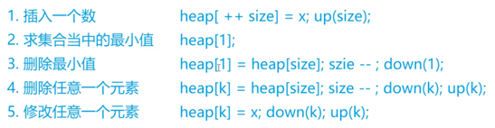

## 堆

I x，插入一个数 x；

PM，输出当前集合中的最小值；

DM，删除当前集合中的最小值（数据保证此时的最小值唯一）；

D k，删除第 k 个插入的数；

C k x，修改第 k 个插入的数，将其变为 x；


```c++
// h[N]存储堆中的值, h[1]是堆顶，x的左儿子是2x, 右儿子是2x + 1
// ph[k]存储第k个插入的点在堆中的位置
// hp[k]存储堆中下标是k的点是第几个插入的
int h[N], ph[N], hp[N], size;

// 交换两个点，及其映射关系
void heap_swap(int a, int b)
{
    swap(ph[hp[a]],ph[hp[b]]);
    swap(hp[a], hp[b]);
    swap(h[a], h[b]);
}

void down(int u)
{
    int t = u;
    if (u * 2 <= size && h[u * 2] < h[t]) t = u * 2; // 左儿子
    if (u * 2 + 1 <= size && h[u * 2 + 1] < h[t]) t = u * 2 + 1; // 右儿子
    if (u != t)
    {
        heap_swap(u, t);
        down(t);
    }
}

void up(int u)
{
    while (u / 2 && h[u] < h[u / 2])
    {
        heap_swap(u, u / 2);
        u >>= 1;
    }
}

// O(n)建堆
for (int i = n / 2; i; i -- ) down(i);
```

